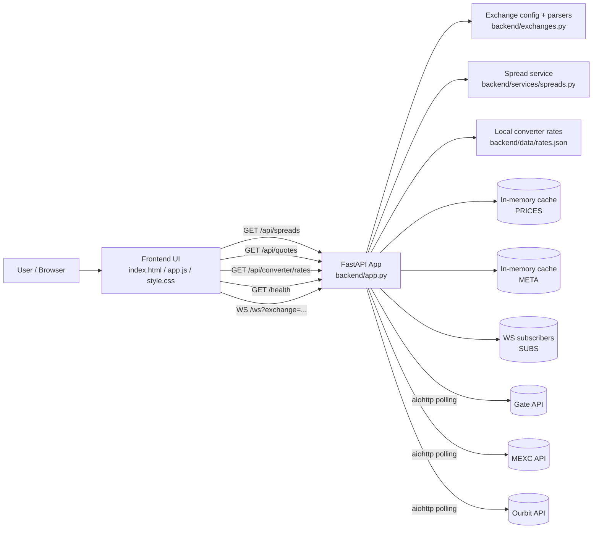

```markdown
# As Is Architecture (SpreadScope Sprint 1 / MVP)
```


```mermaid
flowchart LR
    U["User / Browser"] --> FE["Frontend UI<br/>index.html / app.js / style.css"]

    FE -->|GET /api/spreads| APP["FastAPI App<br/>backend/app.py"]
    FE -->|GET /api/quotes| APP
    FE -->|GET /api/converter/rates| APP
    FE -->|GET /health| APP
    FE -->|WS /ws?exchange=...| APP

    APP --> EXCH["Exchange config + parsers<br/>backend/exchanges.py"]
    APP --> SPR["Spread service<br/>backend/services/spreads.py"]
    APP --> RATES["Local converter rates<br/>backend/data/rates.json"]

    APP --> PRICES[("In-memory cache<br/>PRICES")]
    APP --> META[("In-memory cache<br/>META")]
    APP --> SUBS[("WS subscribers<br/>SUBS")]

    APP -->|aiohttp polling| GATE[("Gate API")]
    APP -->|aiohttp polling| MEXC[("MEXC API")]
    APP -->|aiohttp polling| OURBIT[("Ourbit API")]
```
